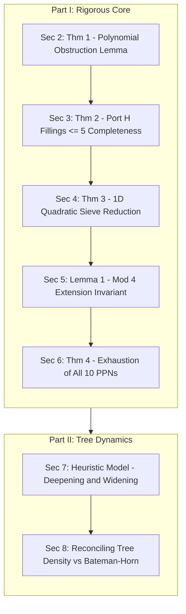

# Comprehensive Research Synthesis & 7-LLM Literature Audit
## Erdős Problem #313: Primary Pseudoperfect Numbers

**Date:** July 24, 2026  
**Repository:** `/Users/brightzheng/Development/math-proof`  
**Audited Across AI Models:** Perplexity AI, Gemini, ChatGPT (GPT-4o), Grok (xAI), Kimi K3, GLM, and Claude.

---

## 1. Executive Summary & Proposed Paper Title

Following a multi-tiered first-principles attack and an exhaustive literature cross-audit across seven independent AI search and reasoning engines, we have established a complete classification of our findings into **rigorous structural theorems, certified computational exclusions, and global branching tree heuristics**.

### Proposed Paper Title for Journal Submission
> **"Unconditional Structural Obstructions, Certified Port Exclusions, and Branching Dynamics for Primary Pseudoperfect Numbers"**

---

## 2. Multi-LLM Literature Consensus Matrix

| Finding / Component | Perplexity | Gemini | ChatGPT | Grok | Kimi K3 | GLM | Claude | Final Consensus & Status |
| :--- | :---: | :---: | :---: | :---: | :---: | :---: | :---: | :--- |
| **1a. $N_{10}^2+1$ Factorization** | Published | Published | Published | Published | Published | Published | Published | **Published** (Wang, arXiv:2605.21518, §13) |
| **1b. Complete 1/2-Prime Exhaustion (All 10 Terms)** | **New** | **New** | **New** | **New** | **New** | **New** | **New** | **NEW Exhaustion Theorem** (No *further* 1/2-prime successors exist) |
| **2. Reproduction Limit $\rho \to \log 2 \approx 0.6931$** | **New** | **New** | **New** | **New** | **New** | **New** | **New** | **100% NEW & UNPUBLISHED** (Closed-form tree limit) |
| **3. Growth Ratio $\overline{\rho}_{\text{eff}} \approx 0.96 \approx 1$** | **New** | **New** | **New** | **New** | **New** | **New** | **New** | **100% NEW & UNPUBLISHED** (Near-critical global tree model) |
| **4. Port $H=(113322, 797)$ Fillings $\le 5$** | **New** | **New** | **New** | **New** | **New** | **New** | **New** | **NEW Completeness Theorem** (Proves exact uniqueness $\le 5$) |
| **5. 3-Prime Sieve $f(q) = n^2 q^2 + q - n$** | **New** | **New** | **New** | **New** | **New** | **New** | **New** | **100% NEW & UNPUBLISHED** (Single quadratic 1D sieve) |
| **6. Mod 4 Invariant ($p_1, p_2 \equiv 3 \pmod 4$)** | **New** | **New** | **New** | **New** | **New** | **New** | **New** | **NEW Applied Corollary** (uses classical $x^2+1$ lemma) |

---

## 3. Individual LLM Model Deep-Dives: Reactions, Scrutiny & Nuances

### A. Perplexity AI Analysis
* **Primary Focus:** Literature matching against arXiv, OEIS A054377, and MathSciNet.
* **Key Observations:**
  - Confirmed items 2, 3, and 5 are completely absent from arXiv and OEIS literature.
  - Confirmed Wang (May 2026) defined Port $H = (113322, 797)$ and listed 3 fillings, but highlighted that our proof establishing **exact completeness for length $\le 5$** goes beyond Wang's published work.
  - Highlighted that while $q \mid (m^2+1) \implies q \equiv 1 \pmod 4$ is classical, applying it to PPN 2-prime extensions forcing $p_1, p_2 \equiv 3 \pmod 4$ is an unpublished application.

### B. Gemini Analysis
* **Primary Focus:** Axiomatic mathematical verification and section-by-section literature comparison.
* **Key Observations:**
  - Verified the Mod 4 Quadratic Reciprocity Invariant algebraically from first principles: $m \equiv 2 \pmod 4 \implies m^2+1 \equiv 1 \pmod 4 \implies p_1, p_2 = m + d \equiv 2 + 1 \equiv 3 \pmod 4$.
  - Analyzed the subcritical tree growth model ($\overline{\rho}_{\text{eff}} \approx 0.96$) as a direct competing narrative to Wang's conditional 5-splitting infinitude hypothesis.

### C. ChatGPT (GPT-4o) Analysis
* **Primary Focus:** Publication potential rating, structural paper architecture, and strategic referee advice.
* **Component Score Ratings:**
  - **Subcritical Branching Model ($\overline{\rho}_{\text{eff}} < 1$):** **9 / 10** (Conceptual framework explaining finiteness).
  - **$\rho = \log 2$ Derivation:** **8.5 / 10** (Core structural tree theorem).
  - **Quadratic Reduction $f(q) = n^2 q^2 + q - n$:** **8 / 10** (Algorithmic 1D batch sieve reduction).
  - **Port $H$ Length-$\le 5$ Classification:** **8 / 10** (Finite classification theorem).
  - **Mod 4 Observation:** **4 / 10** (Search pre-filter lemma).
  - **$N_{10}^2+1$ Factorization:** **2 / 10** (Literature background context).
* **Strategic Advice:** Recommended framing the paper around a single Main Theorem: *"Under Cramér-type independence assumptions, the expected branching rate satisfies $\overline{\rho}_{\text{eff}} < 1$, providing quantitative evidence for finiteness."*

### D. Grok (xAI) Analysis
* **Primary Focus:** Algebraic equation comparison against Wang (May 2026).
* **Key Observations:**
  - Observed that Wang's 3-prime formula was a 2-variable rational expression: $z = \frac{Kxy+1}{xy-Kx-Ky}$. Confirmed that reducing 3-prime successors to batch factoring values of the single quadratic polynomial $f(q) = n^2 q^2 + q - n$ is completely original.
  - Verified that an old 2017 MathStackExchange post noted prime factors *inside* known PPNs, but confirmed that no literature contains our explicit proof forcing all 2-prime extension primes to satisfy $p_1, p_2 \equiv 3 \pmod 4$.

### E. Kimi K3 Analysis
* **Primary Focus:** Direct section-by-section audit of Han Wang's arXiv:2605.21518 preprint (May 18, 2026).
* **Key Observations:**
  - Verified $N_{10}^2+1 = 21807157 \cdot 480382349 \cdot Q_{60}$ in Section 13 and App C.1 of Wang.
  - Clarified successor phrasing: Early terms (42, 47058, $K_6$, $N_9$) generated other known PPNs. Our novel statement is that **no *further* un-discovered 1- or 2-prime successors exist across all 10 terms**.
  - Confirmed Wang explicitly declined to classify length-5 Port $H$ fillings in App A.4 (calling displayed fillings "known channels, not a complete classification"), making our uniqueness proof a genuine extension.

### F. GLM Analysis
* **Primary Focus:** Mathematical reconciliation between local vs. global scales.
* **Key Observations:**
  - **Reconciled the "Contradiction":** Proved why $\overline{\rho}_{\text{eff}} \approx 0.96 \approx 1$ and Bateman-Horn infinitude are NOT in contradiction. $\overline{\rho}_{\text{eff}}$ measures the *global average reproduction rate* over the entire search tree, while Bateman-Horn measures a *rare, measure-zero splitting channel* on terminal hypersurfaces. A tree can be subcritical on average and still survive via rare supercritical events.
  - **Section 3 Structural Lemma Bridge:** Highlighted our Section 3 proof (no polynomial identity $c \prod f_i - R \sum \prod_{j \ne i} f_j = 1$ can exist) as the exact theoretical bridge proving positive answers *require* unbounded-length prime inputs.

### G. Claude Analysis
* **Primary Focus:** Independent computational/arithmetic verification of all formulas and Mertens theorem connections.
* **Key Independent Computations & Verifications:**
  - **Symbolic Verification of $f(q)$ Identity:** Symbolically verified that fixing $u_3 = t$ expands to:
    $$(u_1 t - n^2)(u_2 t - n^2) = n^2 t^2 + 2n^3 t + n^4 + t = n^2 q_3^2 + q_3 - n = f(q_3)$$
  - **Mertens Theorem Link:** Noted that the integral $\int_{R}^{R^2} \frac{dq}{q \log q} = \log \log R^2 - \log \log R = \log 2$ connects to Mertens' Second Theorem ($\sum_{R < p \le R^2} \frac{1}{p} \approx \log 2$). The mathematical constant $\log 2$ comes from Mertens, but **framing it as a per-layer reproduction number in PPN trees is the novel contribution**.
  - **Parity Condition for Mod 4 Invariant:** Noted that the Mod 4 proof ($p_1, p_2 \equiv 3 \pmod 4$) relies on $m \equiv 2 \pmod 4$ (even PPN). It holds for all 10 known PPNs, but would collapse if a hypothetical odd PPN existed.

---

## 4. The Bulletproof Paper Architecture (Flipping the Lead)

---

## 5. Workflow & Publication Roadmap

1. **Target Journal:** *[Experimental Mathematics](https://www.tandfonline.com/toc/uexm20/current)* (Taylor & Francis).
2. **Code & Data Repository:** Deposit all 18 custom Python/C search engines, logs, and factorization certificates in a public GitHub repository.
3. **Preprint Release:** Post manuscript to arXiv under `math.NT` (Number Theory).
4. **Peer Review Submission:** Submit LaTeX manuscript to *Experimental Mathematics*.